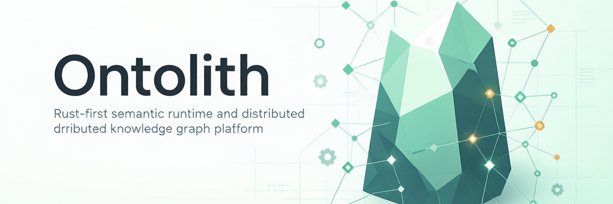

# Ontolith

<p align="center">
  
</p>

<p align="center">
  <a href="docs/Ontolith_Software_Architecture_Specification.md"></a>
  <a href="docs/Ontolith_Development_Plan.md"></a>
  <a href="LICENSE"></a>
</p>

**Rust-first semantic runtime and distributed knowledge graph platform.**

Ontolith is a layered Rust workspace for RDF data modeling, parsing, SPARQL query execution, storage and transaction kernels, cluster control, security, and observability.

---

## Quick Start

```bash
# 1) Build
cargo build --workspace

# 2) Run local gates
./scripts/ci-local.sh

# 3) Run compliance suites directly
cargo test -p ontolith-compliance --test sparql_r1_smoke -- --nocapture
cargo test -p ontolith-compliance --test sparql_w3c_subset -- --nocapture
cargo test -p ontolith-compliance --test w3c11_suite -- --nocapture
cargo test -p ontolith-compliance --test shacl_suite -- --nocapture
```

### Gateway (HTTP + gRPC)

```bash
cargo run -p ontolith-server
```

`ontolith-server` is a long-running gateway. After a one-shot bootstrap metrics
sample it builds `AppState` from the shared environment contract and serves both
access boundaries:

- HTTP: `ONTOLITH_BIND` (default `127.0.0.1:8080`)
- gRPC: `ONTOLITH_GRPC_BIND` (default `127.0.0.1:50051`, `SparqlService{Query, Health}`)

Relevant runtime variables (same contract as the management server):

- `ONTOLITH_STORAGE=memory|rocksdb` plus `ONTOLITH_DATA_DIR=<path>` for the RocksDB backend
- `ONTOLITH_AUTH_MODE=disabled|enforced` (with `ONTOLITH_API_KEY`, or `ONTOLITH_JWT_*` / `ONTOLITH_OIDC_*` for bearer tokens)
- `ONTOLITH_TENANT_MODE` (defaults to `disabled`), `ONTOLITH_AUDIT_PATH`
- `ONTOLITH_TLS_CERT` / `ONTOLITH_TLS_KEY` — the R2 gate rejects a non-loopback *management* bind started without TLS
- `ONTOLITH_BACKUP_DIR` / `ONTOLITH_BACKUP_INTERVAL_SECONDS` for scheduled backups

A production-shaped local runner is provided by `scripts/ontolith-prod-ctl.sh` (see
[Deployment Notes](#deployment-notes)).

### Management Server (Unified Control Plane)

Run a dedicated management server for platform-wide configuration, monitoring, and
data-management operations:

```bash
cargo run -p ontolith-server --bin ontolith-management-server
```

Default bind:

- Management API: `127.0.0.1:9091` (`ONTOLITH_MANAGEMENT_BIND`)
- Runtime bind metadata: `127.0.0.1:8080` (`ONTOLITH_BIND`, reported in admin views)

Key admin endpoints:

- `GET /admin/health`, `GET /admin/config`, `GET /admin/layers`, `GET /admin/plugins`
- `GET /admin/monitoring`, `GET /admin/traces`
- `GET /admin/data/stats`, `GET /admin/data/audit?limit=20`
- `POST /admin/data/replicate`, `POST /admin/data/rebalance`
- `GET|POST /admin/data/backup`, `GET|POST /admin/data/backup/schedule`
- `POST /admin/storage/gc-dictionary`, `POST /admin/storage/vacuum`
- `GET|POST|PUT|DELETE /admin/tenants[/<id>[/keys/<kid>]]`

When `ONTOLITH_AUTH_MODE=enforced`, include `X-API-Key`, `X-Ontolith-Tenant`, and
`X-Ontolith-User` headers.

Optional management ACL split (read/write key separation):

- `ONTOLITH_MANAGEMENT_READ_KEY`: allows read endpoints (`GET /admin/*`)
- `ONTOLITH_MANAGEMENT_WRITE_KEY`: required for mutation endpoints (`POST /admin/data/*`)
- Header: `X-Ontolith-Management-Key: <key>`

Runtime probe setting for management monitoring:

- `ONTOLITH_MANAGEMENT_PROBE_TIMEOUT_MS`: timeout for probing `ONTOLITH_BIND` (default `300` ms)

---

## What You Get

| Capability | Current Shape |
|------------|---------------|
| Semantic core | RDF 1.1 value model + Knowledge Object foundation (L0/L1) |
| Parsing & serialization | N-Triples, N-Quads, Turtle, TriG, RDF/XML + JSON-LD 1.0/1.1 subset |
| Query coverage | SPARQL 1.1 parse/optimize/execute; W3C `rdf-tests` sparql11 profile 492/492 green |
| Validation & reasoning | SHACL core suite 98/98 green + forward-chaining RDFS / OWL 2 RL reasoner |
| Storage | In-memory engine + optional RocksDB backend (MVCC, CF indexes, dictionary GC/vacuum) |
| Cluster | Multi-process Raft data plane (openraft 0.9.25) with RocksDB-backed log/state |
| Gateway model | HTTP + gRPC gateway binaries, long-running listeners with auth/audit/tracing |
| Quality gates | fmt + clippy + workspace tests + compliance + bench thresholds + Miri/sanitizers |

---

## HTTP Gateway Routes

The L5 gateway is implemented in the `ontolith-server` crate (`app` + `http`) and shipped
as the long-running `ontolith-server` binary described above. Available routes:

| Group | Routes |
|-------|--------|
| Ops | `GET /health` (`/healthz`), `GET /ready` (`/readyz`), `GET /metrics`, `GET /audit` |
| Query | `GET\|POST /sparql`, `GET\|POST /explain` |
| Data | `GET /data` (export), `POST /data` and `POST /data/{nt,nq,turtle,trig,rdf-xml,json-ld}` (ingest) |
| Cluster | `GET /cluster[/status\|/membership\|/shards\|/route\|/failover]`, `POST /cluster/{heartbeat,tick,replicate,rebalance,partition,heal}` |
| Reasoning & shapes | `GET /inference`, `POST /materialize`, `POST /validate/shacl` |
| Semantic (L8) | `GET /semantic/search`, `POST /semantic/index` |
| Tenants | `GET\|POST /admin/tenants`, `PUT\|DELETE /admin/tenants/<id>`, `POST /admin/tenants/<id>` (key), `DELETE /admin/tenants/<id>/keys/<kid>` |

To embed the gateway in your own launcher instead of the shipped binary, wire
`AppState` into `HttpServer` directly:

```rust
use ontolith_security::application::HeaderAuthenticator;
use ontolith_server::app::{shared_handler, AppState};
use ontolith_server::http::HttpServer;

fn main() -> std::io::Result<()> {
    let bind = "127.0.0.1:8080".to_string();
    let state = AppState::new_memory(bind.clone(), HeaderAuthenticator::default());
    let server = HttpServer::new(shared_handler(state));
    server.serve(&bind)
}
```

With a listener running:

```bash
curl -s http://127.0.0.1:8080/health
curl -sG http://127.0.0.1:8080/sparql \
  --data-urlencode 'query=SELECT ?s ?p ?o WHERE { ?s ?p ?o } LIMIT 10'
```

When `ONTOLITH_AUTH_MODE=enforced`, include:

- `X-API-Key`
- `X-Ontolith-Tenant`
- `X-Ontolith-User`

---

## Crate Map

The workspace contains 16 crates:

| Layer | Crate | Responsibility |
|-------|-------|----------------|
| L0 | `ontolith-core` | Identity/resource model, canonical encoding, shared errors |
| L1 | `ontolith-rdf` | Term/triple/quad/graph/dataset value model |
| L2 | `ontolith-storage` | Storage abstraction + in-memory/RocksDB adapters |
| L2 | `ontolith-transaction` | Transaction lifecycle and coordination |
| L3 | `ontolith-parser` | RDF parsing & serialization (NT/NQ/Turtle/TriG/RDF-XML, JSON-LD subset) |
| L3 | `ontolith-query` | SPARQL parse/optimize/execute pipeline |
| L4 | `ontolith-cluster` | Cluster consistency, multi-process Raft data plane |
| L5 | `ontolith-server` | Access boundary: HTTP + gRPC gateways, management server |
| L6 | `ontolith-reasoner` | Forward-chaining RDFS / OWL 2 RL reasoning + SHACL validation |
| L8 | `ontolith-ai` | Semantic retrieval, ANN/LSH indexing, remote embedding |
| L9 | `ontolith-geo` | GeoSPARQL scoped capability |
| Support | `ontolith-security` | Auth context, authorization, audit (hash chain), OIDC |
| Support | `ontolith-observability` | Metrics/tracing/logging model |
| Support | `ontolith-plugin-api` | Plugin boundaries and contracts |
| Support | `ontolith-sdk` | SDK-facing integration surface |
| Quality | `ontolith-compliance` | SPARQL smoke, W3C sparql11 + SHACL suite harnesses |

---

## Development Workflow

```bash
cargo fmt --all -- --check
cargo clippy --workspace --all-targets -- -D warnings
cargo test --workspace --all-targets
```

Strict subset gate:

```bash
ONTOLITH_W3C_SUBSET_STRICT=1 ./scripts/ci-local.sh
```

Memory-safety gates for the kernel crates require a nightly toolchain. Run them
directly, or opt them into `ci-local` with `CI_LOCAL_MIRI=1` / `CI_LOCAL_SANITIZER=1`
(the CI `miri-sanitizer` job does both; without nightly the script skips them):

```bash
cargo +nightly miri test -p ontolith-core -p ontolith-rdf -p ontolith-transaction
cargo +nightly miri test -p ontolith-storage --no-default-features
RUSTFLAGS="-Zsanitizer=address -D warnings" \
  cargo +nightly test -p ontolith-core -p ontolith-rdf -p ontolith-transaction \
    -p ontolith-storage --no-default-features
```

Compliance baselines are profile-locked: W3C `rdf-tests` sparql11 492/492 and W3C
SHACL core 98/98 (both `fail=0`, `drift=0`). Drift against the locked profile fails
the test, so regressions surface in CI rather than in release notes.

---

## Deployment Notes

Deployment assets are provided under `deployments/` and `scripts/`.

```bash
# local production-shaped runner (gateway + management server, RocksDB backend)
cargo build -p ontolith-server --release
./scripts/ontolith-prod-ctl.sh {start|stop|status|restart|logs}

# user-level service
cargo build -p ontolith-server --release
./scripts/install-ontolith-user-service.sh

# system-level service
cargo build -p ontolith-server --release
./scripts/install-ontolith-system-service.sh

# management server (user/system service)
cargo build -p ontolith-server --release --bin ontolith-management-server
./scripts/install-ontolith-management-user-service.sh
# or
./scripts/install-ontolith-management-system-service.sh

# SLO collection / evaluation timers
cargo build -p ontolith-server --release --bin ontolith-management-server
./scripts/install-ontolith-slo-timers.sh

# management console (Vite 8 SPA + zero-dependency Node API server, see console/README.md)
cd console && npm install && npm run build && npm start      # http://127.0.0.1:8890
```

`ontolith-server` and `ontolith-management-server` are both long-running listeners, so
either can be handed to systemd directly; env templates live in `deployments/`.

---

## Documentation

| Document | Purpose |
|----------|---------|
| `docs/Ontolith-White-Paper.md` | Technical white paper (WP-0001): capability and architecture overview |
| `docs/Ontolith_Software_Architecture_Specification.md` | Architecture baseline and constraints (SAS-0001) |
| `docs/Ontolith_Development_Plan.md` | Delivery planning and milestones (PLAN-0001) |
| `docs/PROGRESS.md` | Progress ledger and changelog (PROG-0001) |
| `docs/L0-ontolith-core-Knowledge-Object-Foundation.md` | L0 implementation notes |
| `docs/L1-ontolith-rdf-Statement-Graph-Dataset.md` | L1 implementation notes |
| `docs/L2-ontolith-storage-transaction-kernel.md` | L2 implementation notes |
| `docs/L2-storage-contracts.md` | L2 storage contract reference |
| `docs/L3-ontolith-parser-query.md` | L3 implementation notes |
| `docs/L4-ontolith-cluster-consistency.md` | L4 cluster/consistency and read-routing contract |
| `docs/L5-ontolith-access-security.md` | L5 API and security baseline |
| `docs/L5-management-platform-slo.md` | Management plane, SLO gates, admin endpoints |
| `docs/L5-systemd-service.md` | systemd operation guide |
| `docs/L7-ops-rebalance-dr.md`, `docs/L7-release-rollback.md` | Rebalance/DR drills and release/rollback runbooks |
| `docs/L8-ai-native.md`, `docs/L9-geosparql.md` | L8 retrieval and L9 GeoSPARQL notes |
| `adr/` | Architecture Decision Records |
| `rfc/` | Proposals and design drafts (RFC-0001 canonical encoding is Accepted) |

---

## Repository Layout

```text
ontolith/
├── crates/
├── docs/
├── rfc/
├── adr/
├── tests/
├── examples/
├── console/
├── scripts/
├── benchmarks/
└── deployments/
```

---

## Author

- Name: shark8848
- Email: admin@sharky-ai.com

## License

GPL-3.0. See LICENSE for full terms.
